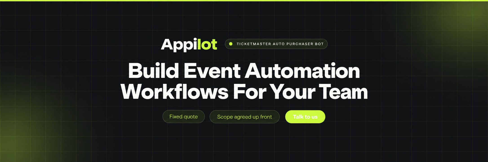
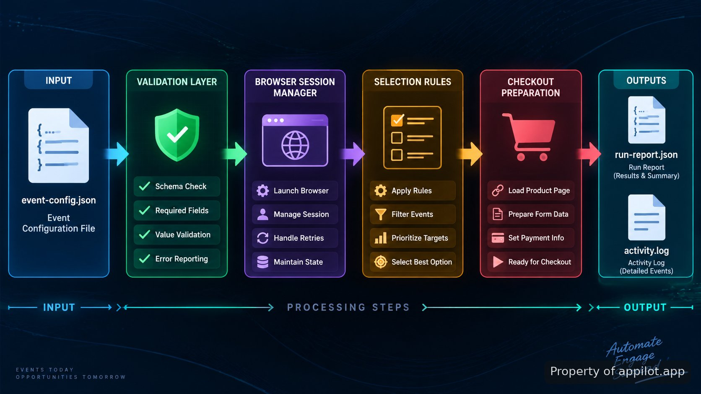

 


## Appilot's ticketmaster auto purchaser bot

> Appilot's ticketmaster auto purchaser bot is a repository for managing a configured event workflow through browser automation components. The project focuses on preparing event searches, handling browser sessions, applying selection rules, and recording run results. The system is structured around repeatable actions rather than manual clicking through every stage of an event page.

The repository separates configuration, automation logic, session handling, and output records so each part can be reviewed independently. A demonstration walkthrough is available in the project notes through this Loom recording: https://www.loom.com/share/7174cc2ad66146d291785cf4866e1c6f

 

<p align="center">
  <a href="https://t.me/devpilot1" target="_blank"></a>
  <a href="mailto:support@appilot.app" target="_blank"></a>
  <a href="https://Appilot.app" target="_blank"></a>
  <a href="https://discord.gg/wpfG4j84" target="_blank"></a>
</p>


**How the event workflow is organized**

The system begins with defined event parameters, account settings, and selection preferences. Those values move through validation before the browser layer starts. This prevents missing configuration from reaching the automation stage and gives operators a clear record of what was requested during each run.

The event lookup layer can connect with documented event data sources such as the [Ticketmaster API documentation](https://developer.ticketmaster.com/products-and-docs/). The API documentation describes event discovery endpoints used for finding event, attraction, and venue information. Browser actions are kept separate from data retrieval so changes in one area do not require rebuilding the entire project.

Feature Description
Event configuration loading Removes repeated manual entry by loading event URLs, preferences, and run settings from project configuration files.
Browser session control Handles browser startup, saved session data, and controlled page actions through a dedicated automation layer.
Selection rule handling Reduces inconsistent choices by applying configured ticket preferences and storing the selected results.
Run logging Keeps execution records, errors, and status messages so technical reviewers can inspect each workflow stage.
Output reporting Creates structured files containing run details instead of leaving results only inside a browser window.

 

**Browser automation design**

The browser layer uses [Playwright automation](https://playwright.dev/docs/intro) patterns to control pages, locate elements, and manage browser contexts. Playwright provides browser APIs for Chromium, Firefox, and WebKit workflows, making it suitable for controlled testing and automation environments.

The main engineering concern is keeping each workflow stage observable. A failed selector, missing page element, or incomplete configuration should produce a readable log entry instead of an unexplained stop. The project records these states so maintenance work can focus on the exact failing component.

The browser workflow follows a defined sequence: open the configured event page, verify expected page elements, apply stored preferences, collect the result state, and write the outcome. The separation between browser actions and configuration makes it possible to review changes without editing every automation file.

**Project structure and responsibilities**

```
      src/
        main.py
        automation/
          browser_runner.py
          event_flow.py
          selection.py
        utils/
          config_loader.py
          logger.py
      config/
        settings.yaml
        events.yaml
      logs/
        activity.log
      output/
        run-report.json
      requirements.txt
      README.md
```


**Configuration and execution flow**

The project keeps runtime values outside the main automation code. Event details, browser preferences, and selection rules are loaded before execution begins. A typical configuration defines the target event, preferred ticket properties, and output locations.

```
    python main.py --config config/settings.yaml
    python main.py --event-config config/events.yaml
    python main.py --report output/run-report.json
```

A run produces structured information that can be reviewed after completion. Logs show the sequence of actions, while report files provide a machine-readable record for later analysis. This approach keeps debugging information available without requiring someone to watch every browser action.

**Use Cases**

Event operations teams use the workflow to keep event preferences, browser actions, and execution records in one repository.
Automation engineers use the modular structure to review browser behavior, update selectors, and maintain separate configuration files.
Developers building ticket purchasing automation can use the project layout as a reference for separating inputs, actions, and outputs.

**Connected tools and technical references**

The project uses common automation components with documented interfaces. [Playwright's browser API reference](https://playwright.dev/docs/api/class-page) explains page control methods used by browser workflows. [Selenium WebDriver documentation](https://www.selenium.dev/documentation/webdriver/) provides additional background on browser control concepts.

For event information workflows, the [Ticketmaster Discovery API guide](https://developer.ticketmaster.com/products-and-docs/apis/discovery-api/v2/) documents event discovery requests and response structures. These references help maintain clear boundaries between event data handling and browser execution.

## How to Run Using Appilot's ticketmaster auto purchaser bot

**STEP 1 — Download & Set Up the Project** Get the repository files, install dependencies, and prepare the environment before running the automation workflow. <br>
**STEP 2 — Load Configuration** Open the project and provide event settings, browser options, and selection preferences through the configuration files. <br>
**STEP 3 — Start The Workflow** Run the command entry point and allow the browser manager to process the configured event flow.<br>
**STEP 4 — Review Results** Check generated logs and reports to inspect completed actions, errors, and recorded workflow states. <br>

## Repository maintenance notes

Browser-based systems require regular review because page structures, authentication flows, and external interfaces change over time. The repository keeps selectors, configuration, and execution logic separated so updates can be made in the correct area.

The project also includes logging points around important transitions. When a workflow stops, maintainers can identify whether the issue came from configuration, browser navigation, element handling, or output generation.


 

## FAQs

**How does the automation handle event selection and ticket preferences?** 

>The workflow reads configured event details and selection preferences before browser actions begin. Those values guide the selection layer and are recorded with the final run output so the process can be reviewed.

**Can the project work with the Ticketmaster API?**

>The project structure supports connecting event data sources through separate modules. The Ticketmaster API documentation provides official information about available discovery endpoints and data formats that can be used when an approved API workflow is required.

**What technology is used for the browser workflow?**

>The browser layer uses Playwright-based automation patterns with separated configuration and logging components. This keeps browser actions, settings, and output records easier to inspect during

